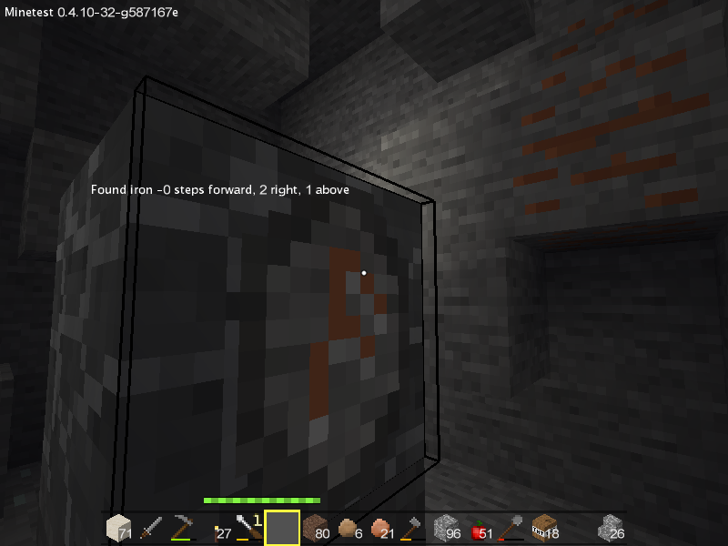

Runes mod
=========

**Take a pick and use it to draw some runes in stone.**
**When your are done, place your rune somewhere, activate it and let it's magic help you.**

This mod adds some new nodes called "runes" that when activated, gives you some 
hint about the sourrounding area.

Current version is tested and targetted to work with the carbone game.

Miners's rune
-------------

This rune will guide you to a selected ore type.

Craft receipt: 

    pick
    stone

How to use:

Place the rune somewhere, use right-click to activate the rune and to change the searched ore type.
Use left-click to update the search.

When the rune is digged, it becomes inactive.

